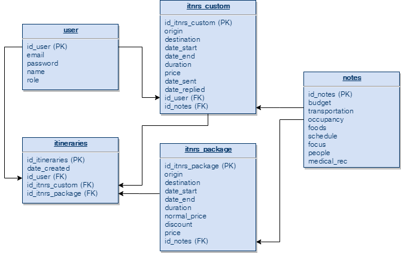

# FunTav

<p align="center">
      
</p>

## Table of Contents
- [Introduction](#introduction)
- [Tools](#Tools)
- [Installation](#Installation)
- [Database Design](#DatabaseDesign)
- [Dependencies](#Dependencies)
- [Postman Collection](#Collection)
---
 
## Introduction

<p>FunTav is specialized on making custom tour and travel inquiries based on customer’s.</p>

## Tools

- XAMPP
- Visual Studio Code
- Node.js
- Terminal
- Postman

## Installation

### Clone
```bash
$ git clone https://github.com/szatrio/funtav

Back-End
$ cd funtav_backend
$ npm install

Front-End
$ cd funtav_frontend
$ npm install
```
---

### Create Environment Variable
```bash
$ cp .env.example .env
$ nano .env
```
---
### Start Development Server
```bash
$ npm start
```
--- 

## DatabaseDesign 

<p align="center">
      
</p>

## Dependencies

BackEnd

| Plugin |
| ------ |
| express |
| mysql |
| bcryptjs |
| body-parser |
| dotenv |
| jsonwebtoken |
| morgan |

## Collection

<p>Postman Collection Link for testing API</p>
https://www.getpostman.com/collections/390625b2c224f62f6231

License
----

© Satrio Utomo